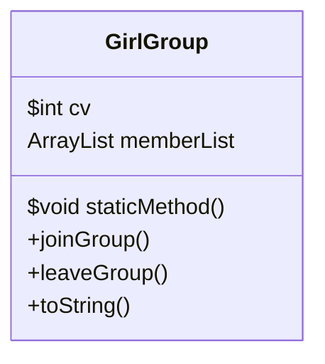

### Chapter 6 실습내용
- 클래스변수, 인스턴스 변수
  - 클래스 변수를 사용할때는 참조변수.cv를 쓰는 것보다 클래스명.cv로 사용하는걸 권장

### Chapter 7 실습내용
- 상속과 포함
  - 기존에 작성한 GirlGroup 클래스가 Artist의 클래스를 상속받게 구현했다
  - 부모클래스인 Artist <- 자손클래스인 GirlGroup
  - 추후 Artist 클래스를 상속받는 BoyGroup, Solo, Actor 클래스 구현도 가능하다
  - 공통된 속성을 Artist 클래스로 올렸다
- 오버라이딩 
  - toString() 메서드로 오버라이딩 했다
- 접근제어자
  - name 과 debut을 protected로 선언해서 다른 패키지
~~~java 
/ch7/Artist.java
public class Artist {
    protected String name;
    protected LocalDate debutDt;
~~~
~~~java
/ch6/GirGroup.java
  public void setName(String name) {
    super.name = name;
  }

  public String getName() {
    return name;
  }

  public LocalDate getDebutDt() {
    return debutDt;
  }
~~~

  

