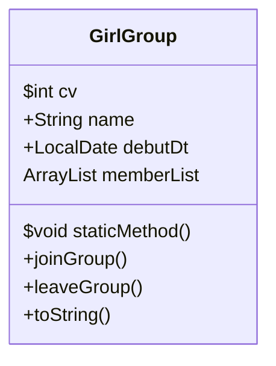

# Chapter 6 실습내용
- 클래스변수, 인스턴스 변수
    - 클래스 변수를 사용할때는 참조변수.cv를 쓰는 것보다 클래스명.cv로 사용하는걸 권장

```mermaid
classDiagram
    class GirlGroup{ 
        $int cv
        +String name
        +LocalDate debutDt
        ArrayList<Member> memberList
        $void staticMethod()
        +joinGroup()
        +leaveGroup()
        +toString()
    }
```
