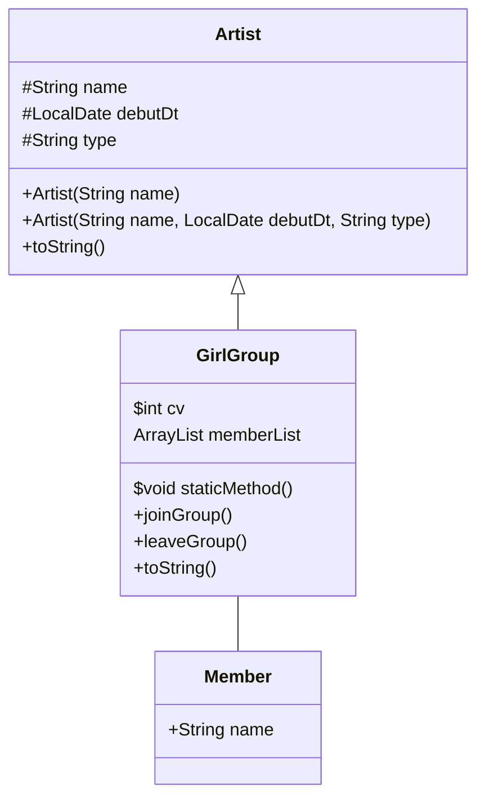

# Chapter 7 실습내용

- 상속과 포함
    - 기존에 작성한 GirlGroup 클래스가 Artist의 클래스를 상속받게 구현했다
    - 부모클래스인 Artist <- 자손클래스인 GirlGroup
    - 추후 Artist 클래스를 상속받는 BoyGroup, Solo, Actor 클래스 구현도 가능하다
    - 공통된 속성을 Artist 클래스로 올렸다
- 오버라이딩
    - toString() 메서드로 오버라이딩 했다
- 접근제어자
    - name 과 debut을 protected로 선언해서 다른 패키지
    - final 이 붙은 변수는 상수이므로 선언과 초기화를 동시에 진행
    - final 이 붙인 인스턴스 변수는 생성자에서 초기화 가능
    - 인스턴스를 생성할 때 final 이 붙은 멤버변수를 초기화하는데 필요한 값을 생성자의 매개변수로 제공받는 것
~~~java 
/ch7/Artist.java
public class Artist {
    protected String name;
    protected LocalDate debutDt;
~~~
~~~java
/ch6/GirGroup.java
  public void setName(String name) {
    super.name = name;
  }

  public String getName() {
    return name;
  }

  public LocalDate getDebutDt() {
    return debutDt;
  }
~~~
