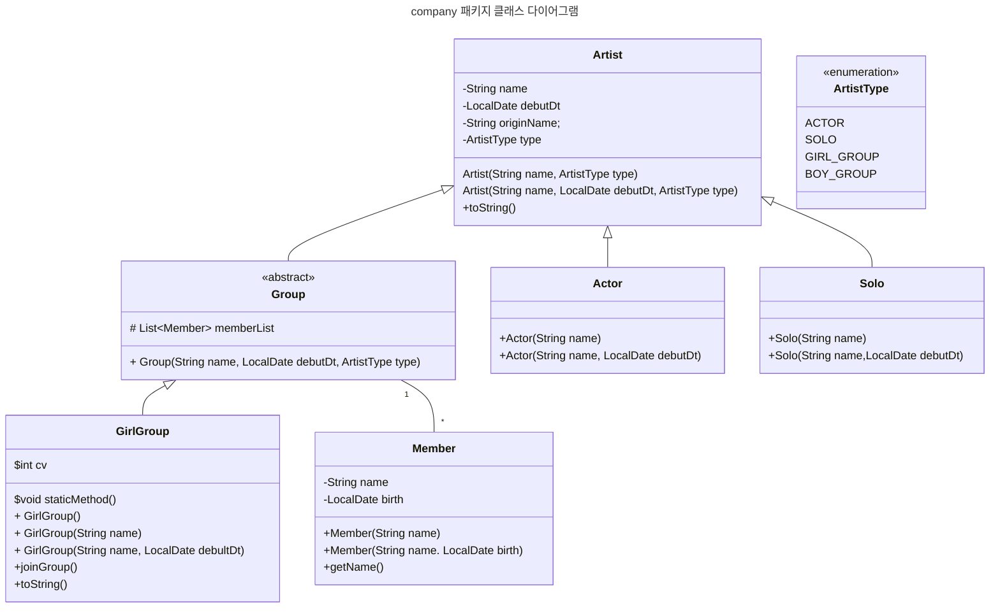
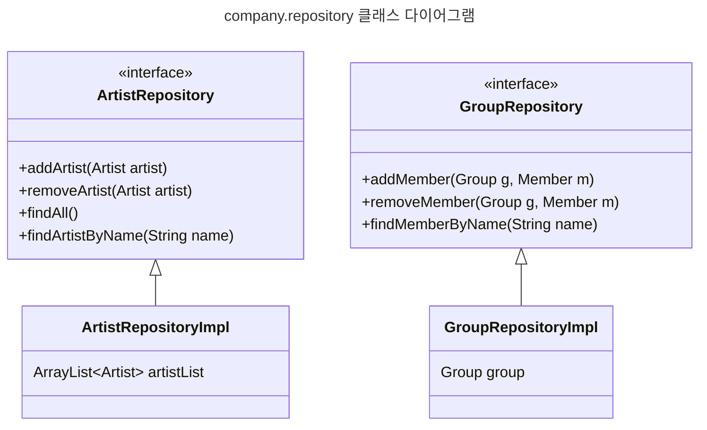

# 클래스다이어그램

```mermaid
---
title: company 패키지 클래스 다이어그램
---
classDiagram
    Artist <|-- Group
    Artist <|-- Actor
    Artist <|-- Solo
    Group <|-- GirlGroup
    Group "1"--"*" Member
    class Artist {
        -String name
        -LocalDate debutDt
        -String originName;
        -ArtistType type
        Artist(String name, ArtistType type)
        Artist(String name, LocalDate debutDt, ArtistType type)
        +toString()
    }
    
    class ArtistType{
        <<enumeration>>
        ACTOR
        SOLO
        GIRL_GROUP
        BOY_GROUP
    }
    
    class Actor {
        +Actor(String name)
        +Actor(String name, LocalDate debutDt)
    }
    
    class Group {
        <<abstract>>
        # List~Member~ memberList
        + Group(String name, LocalDate debutDt, ArtistType type)
    }
    
    class GirlGroup{ 
        $int cv
        $void staticMethod()
        + GirlGroup()
        + GirlGroup(String name)
        + GirlGroup(String name, LocalDate debultDt)
        +joinGroup()
        +toString()
    }
    
    class Member{
        -String name
        -LocalDate birth
        +Member(String name)
        +Member(String name. LocalDate birth)
        +getName()
    }
    
    class Solo {
        +Solo(String name)
        +Solo(String name,LocalDate debutDt)
    }

```

```mermaid
---
title: company.repository 클래스 다이어그램
---
classDiagram
    ArtistRepository <|-- ArtistRepositoryImpl
    GroupRepository <|-- GroupRepositoryImpl
    
    class ArtistRepository {
        <<interface>>
        +addArtist(Artist artist)
        +removeArtist(Artist artist)
        +findAll()
        +findArtistByName(String name)
    }
    
    class ArtistRepositoryImpl {
        ArrayList~Artist~ artistList
    }
    
    class GroupRepository {
        <<interface>>
        +addMember(Group g, Member m)
        +removeMember(Group g, Member m) 
        +findMemberByName(String name) 
    }
    
    class GroupRepositoryImpl {
        Group group
    }

```